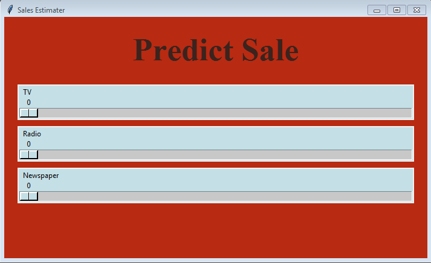
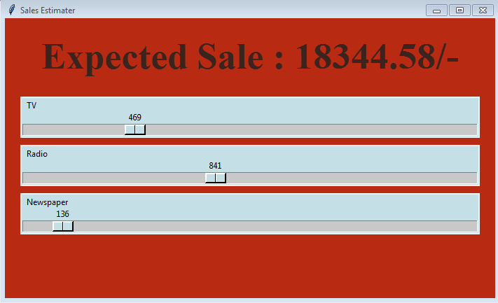

# Predict-Sales
This is a basic project on Simple and Multiple Linear Regression model. 
The model is trained through Advertisement dataset and is used to predict the Sales for a company. 
For the simplicity a python-tkinter GUI is also created using the model where the user can specify the input range and get the prediction approximately.

### GUI LOOK!

